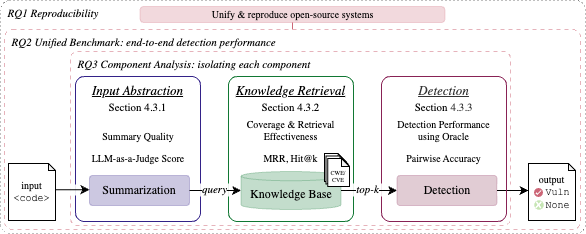

<div align="center">

# Retrieval-Augmented Generation for Software Vulnerability Detection (RAG4SVD)

**Retrieve, Reproduce, Reveal: Dissecting Retrieval-Augmented Software Vulnerability Detection**


[**Sabrina Kaniewski**](https://www.hs-esslingen.de/personen/sabrina-kaniewski)<sup>1</sup> · **Tim Krämer**<sup>1</sup> · [**Julius Bächle**](https://www.hs-esslingen.de/personen/julius-baechle)<sup>1</sup> · [**Markus Enzweiler**](https://markus-enzweiler.de/)<sup>1</sup> · [**Michael Menth**](https://uni-tuebingen.de/fakultaeten/mathematisch-naturwissenschaftliche-fakultaet/fachbereiche/informatik/lehrstuehle/kommunikationsnetze/staff/michael-menth/)<sup>2</sup> · [**Tobias Heer**](https://www.hs-esslingen.de/personen/tobias-heer)<sup>1</sup>

<sup>1</sup> **Esslingen University of Applied Sciences** · <sup>2</sup> **University of Tübingen**


</div>

---

This repository provides the replication package for **Retrieve, Reproduce, Reveal: Dissecting Retrieval-Augmented Software Vulnerability Detection**.

We reproduce and benchmark six open-source RAG-based software vulnerability detection (RAG4SVD) systems under a common open-weight evaluation setting, and dissect representative pipelines into input abstraction, knowledge retrieval, and vulnerability detection. The repository contains the adapted system implementations, datasets and intermediate artifacts, evaluation scripts, and analysis notebooks underlying the research questions RQ1-RQ3:

- **RQ1 - Reproducibility:** To what extent are published open-source RAG4SVD systems reproducible?
- **RQ2 - Unified Benchmark:** How do open-source RAG4SVD systems compare under a unified benchmark?
- **RQ3 - Component Analysis:** Which component-level factors drive detection in representative RAG4SVD pipelines?


<p align="center">

</p>

<br>

## 📁 Project Structure
```
/
├── README.md
├── LICENSE
├── figures/                      # Figures used in the paper/README
│
├── systems/                      # Reproduced/adapted RAG4SVD systems
│   ├── svd-bench/
│   ├── llama-vd/
│   ├── grace/
│   ├── llm4vuln/
│   ├── vul-rag/
│   └── vul-triage/
│
├── evaluation/
│   ├── rq1_reproducibility/      # Reproduction results
│   ├── rq2_benchmark/            # Benchmark results, parsing statistics
│   └── rq3_components/           # Judge evaluation, full results
│
└── docs/
    ├── RAG4SVD_selection.md      # RAG4SVD study selection
    ├── DATASETS.md               # Dataset checkpoints
    └── MODELS.md                 # Model checkpoints
```

## 📝 Citation
If you use **this work**, please cite! 📚 
```bibtex
@preprint{kaniewskiRAG4SVD2026,
    title     = {{Retrieve, Reproduce, Reveal: Dissecting Retrieval-Augmented Software Vulnerability Detection}}, 
    author    = {Kaniewski, Sabrina and Krämer, Tim and Bächle, Julius and Enzweiler, Markus and Menth, Michael and Heer, Tobias},
    year      = {2026},
}
```